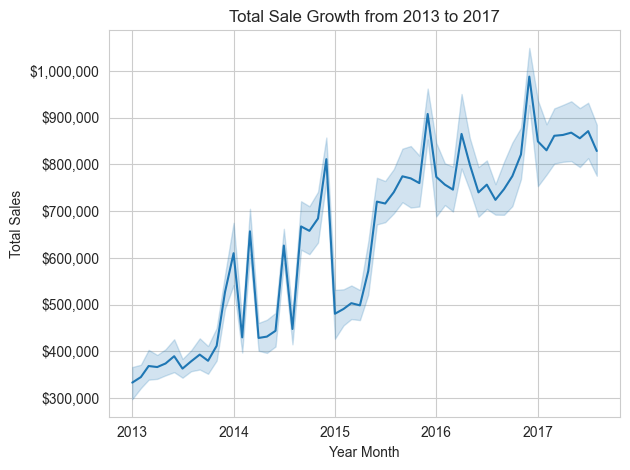

# Store Sales Time Series Forecasting

This repository contains a personal project for forecasting store-level sales using time series methods (SARIMAX) with exogenous regressors (holidays). The goal is to demonstrate end-to-end data preparation, modeling and evaluation. 

## Project Overview

**Dataset**: Daily sales data by store and product family from the Kaggle "Store Sales - Time Series Forecasting" competition. Including supplemental dataset, holidays, to indicate holiday date events. 

**Objective**: Build and evaluate one-step-ahead SARIMAX model to predict daily (and aggregated monthly) sales, incorporating holiday indicators as exogenous variables. 

**Key Steps**:

1. Data loading and cleaning 

2. Aggregation to daily and monthly totals 

3. Feature engineering (holiday flag, date parsing)

4. Model fitting with pmdarima.auto_arima and walk-forward forecasting 

5. Evaluation using RMSE, visualization of actuals vs. predictions 

## Data Description 

After basic EDA, we observe that there has been systematic growth in sales (steadily increasing year over year) for specific product families. However, for a learning experiment we do not consider modeling for specific product families due to having to create different models, using the SARIMAX method, for each product families. Further, we consider the high cardinatlity of the product family feature. 

We observe the following total sales growth from 2013 to 2017 in the training data as shown below: 

